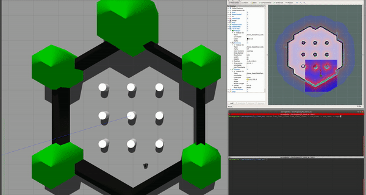

# Client tests

To emulate a running robot and also a running free fleet server,

```bash
# Terminal A
roscore

# Terminal B, at this point it will be asking for the move base action server, which will timeout after 10 seconds
rosrun free_fleet_client free_fleet_client

# Terminal C, the fake move base action server, the client will then be listening for transform frames
rosrun free_fleet_client test_action_server

# Terminal D, the fake static transform
rosrun tf static_transform_publisher 0.0 0.0 0.0 0.0 0.0 0.0 1.0 base_footprint map 200
```

The client will then start subscribing to all the necessary topics, and start publishing robot states over DDS to the server. To demonstrate this behaviour,

```bash
rosrun free_fleet_client test_dds_sub_state
```

The client will also be listening for requests over DDS, which will trigger action server calls for `MoveBase`. To demonstrate this behaviour

```bash
# sends out a single destination request to the robot over DDS
rosrun free_fleet_client test_dds_pub_destination_request

# sends out a path request, basically a sequence of destination requests to the robot over DDS
rosrun free_fleet_client test_dds_pub_path_request

# sends out a path request with locations corresponding to real map locations
rosrun free_fleet_client test_dds_pub_sim_path_request

# sends out a mode request, to pause and resume what it is doing
rosrun free_fleet_client test_dds_pub_mode_request pause
rosrun free_fleet_client test_dds_pub_mode_request ressume
```

# Client simulation test



To simulate working with a live ROS 1 navigation stack, we will use the Turtlebot3 navigation examples given [here](http://emanual.robotis.com/docs/en/platform/turtlebot3/simulation/).

Follow the examples and proceed to launch the simulation, mapping, saving the map, and launching the navigation stack with the saved map. For convenience we have also included sample maps, generated using `gmapping` just like the examples [here](../clients/ros1/free_fleet_client/test_maps).

In a separate terminal, source the workspace where `free_fleet_client` was built, and launch the client with fleet name, robot name and robot model as mandatory arguments,

```bash
source ~/client_ws/devel/setup.bash
rosrun free_fleet_client free_fleet_client -f FLEET_NAME -r ROBOT_NAME -m ROBOT_MODEL
```

Use the flag `-h` for more information about the default values of all optional arguments and how to adjust them to your needs.

Similar to the section above, the built test executables can now be run to control and monitor the robot. We recommend using the `map.yaml` map, which corresponds to `turtlebot3_world` in the ROBOTIS examples.

```bash
# destination request
rosrun free_fleet_client test_dds_pub_destination_request

# path request
rosrun free_fleet_client test_dds_pub_sim_path_request
```

While the simulation is running, the robot's state can be observed by calling the DDS subscribing executable,

```bash
rosrun free_fleet_client test_dds_sub_state
```
